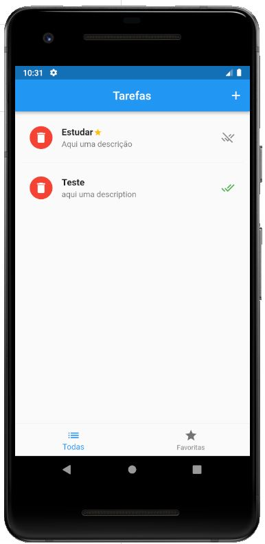
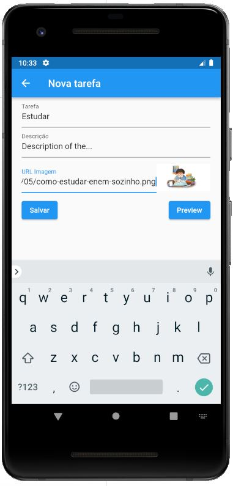

# App de tarefas

App para estudo do Flutter.

## Escopo de estudo

- Inserir imagem e validar url
- Provider
- Favoritar 
- Marcar tarefa como feita
- Salvar no Git
- Mover feitos para outra tela
- Editar conteúdo em nova página
- Filtro para buscar tarefa
- Ordenar por data 
- Desmissible (favorite e excluir)
- Hive e SharedPreferences
- Firebase
- Carregar imagem do dispositovo ou camera

